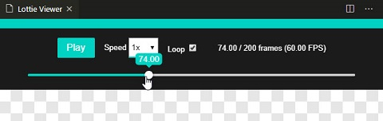

> ! This repo is a fork of [Lottie Viewer from William DA SILVA](https://github.com/WilliamDASILVA/lottie-viewer) which allows it to run in newer VSCode versions and adds a timeline slider.

# Lottie Viewer

Visual Studio Code extension to preview your Lottie JSON files and even edit them with more confidence.
Open your JSON file then, run the `Lottie Preview` command.

## Features

- Preview the current open Lottie JSON file
- Basic view controls (play / pause, speed)
- Scrub through the animation with a slider

### For more information

* [Lottie documentation](https://github.com/airbnb/lottie-web)
* [VSCode extension](https://code.visualstudio.com/docs/extensionAPI/vscode-api)
* [Lottie files for demo](https://www.lottiefiles.com/)

-----------------------------------------------------------------------------------------------------------

## Setup for development

1. Run `npm install` in both root and `/web` directory.
2. Run `npm run build` in the `/web` directory everytime you edit the Lottie web app

### To deploy

1. Run `npm run build` in the `/web` directory to generate the Lottie app
2. Update version in `package.json`, the run `vsce package` and upload the generated `.vsix` file to [the marketplace](https://marketplace.visualstudio.com/manage/publishers/).

**Enjoy!**
